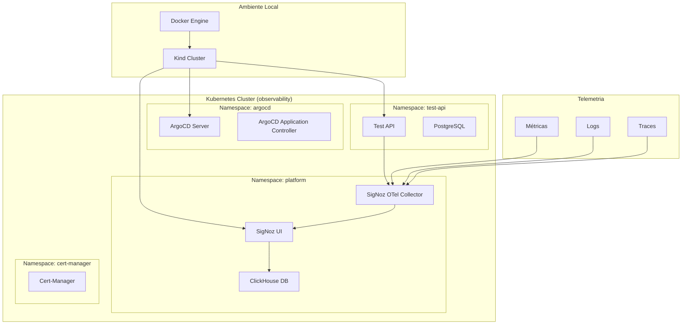

# 🚀 SRE - Site Reliability Engineering

## 📋 Visão Geral

Repositório centralizado com **ferramentas e soluções de observabilidade** para Site Reliability Engineering, oferecendo uma stack completa de monitoramento, logging, tracing e gerenciamento de aplicações em ambientes Kubernetes.

### 🎯 Objetivo

Fornecer uma solução **segmentada e modular** de observabilidade que permite:
- **Instalação independente** de cada componente
- **Documentação técnica completa** para cada ferramenta
- **Scripts automatizados** para instalação e gerenciamento
- **Exemplos práticos** de integração e uso

---

## 🏗️ Arquitetura do Sistema



---

## 🚀 Componentes Disponíveis

### 🔧 Ferramentas Principais

| Componente | Descrição | Documentação | Instalação |
|------------|-----------|--------------|------------|
| **[Kubernetes Local](observabilidade-k8s-local/)** | Cluster Kind para desenvolvimento | [📖 README](observabilidade-k8s-local/README.md) | `./install.sh` |
| **[ArgoCD](observabilidade-argocd/)** | GitOps e deployment contínuo | [📖 README](observabilidade-argocd/README.md) | `./install.sh` |
| **[OpenTelemetry](observabilidade-opentelemetry/)** | Coleta universal de telemetria | [📖 README](observabilidade-opentelemetry/README.md) | `./install.sh` |
| **[SigNoz](observabilidade-signoz/)** | Plataforma de observabilidade | [📖 README](observabilidade-signoz/README.md) | `./install.sh` |

### 📚 Documentação Técnica

| Documento | Descrição | Conteúdo |
|-----------|-----------|----------|
| **[Documentação Completa](observabilidade-documentacao/DOCUMENTACAO-COMPLETA.md)** | Guia técnico detalhado | Arquitetura, configurações, troubleshooting |
| **[Especificações Técnicas](observabilidade-documentacao/ESPECIFICACOES-TECNICAS.md)** | Requisitos e especificações | Hardware, software, dependências |
| **[Mapeamento Técnico](observabilidade-documentacao/MAPEAMENTO-TECNICO.md)** | Interconexões e dependências | Diagramas, fluxos, integrações |
| **[Resumo Executivo](observabilidade-documentacao/RESUMO-EXECUTIVO.md)** | Visão de alto nível | Benefícios, ROI, roadmap |

### 🧪 Exemplos e Testes

| Componente | Descrição | Arquivos |
|-------------|-----------|----------|
| **[Test API](test-api/)** | API de exemplo com telemetria | `k8s/*.yaml` |
| **ArgoCD Apps** | Aplicações de exemplo | `test-api/k8s/argocd-app-*.yaml` |
| **Kustomize** | Configurações por ambiente | `test-api/k8s/base/`, `test-api/k8s/overlays/` |

---

## 🛠️ Instalação Rápida

### 📋 Pré-requisitos

- **Docker** (versão 20.10+)
- **kubectl** (versão 1.24+)
- **Helm** (versão 3.8+)
- **Git** (versão 2.30+)
- **4GB RAM** mínimo
- **10GB espaço** em disco

### 🚀 Instalação Sequencial

```bash
# 1. Clone o repositório
git clone <seu-repositorio>
cd SRE

# 2. Instalar Kubernetes local
cd observabilidade-k8s-local
./install.sh

# 3. Instalar OpenTelemetry
cd ../observabilidade-opentelemetry
./install.sh

# 4. Instalar SigNoz
cd ../observabilidade-signoz
./install.sh

# 5. Instalar ArgoCD
cd ../observabilidade-argocd
./install.sh
```

### ⚡ Instalação Individual

```bash
# Kubernetes Local
cd observabilidade-k8s-local && ./install.sh

# OpenTelemetry
cd observabilidade-opentelemetry && ./install.sh

# SigNoz
cd observabilidade-signoz && ./install.sh

# ArgoCD
cd observabilidade-argocd && ./install.sh
```

---

## 📊 Acesso aos Serviços

### 🌐 URLs de Acesso

| Serviço | URL | Credenciais |
|---------|-----|-------------|
| **SigNoz UI** | http://localhost:3301 | Acesso direto |
| **ArgoCD UI** | https://localhost:8080 | admin / [senha gerada] |
| **Test API** | http://localhost:8080 | Acesso direto |

### 🔧 Comandos de Port-Forward

```bash
# SigNoz
kubectl port-forward -n platform svc/signoz 3301:8080

# ArgoCD
kubectl port-forward svc/argocd-server -n argocd 8080:443

# Test API
kubectl port-forward svc/test-api-telemetry-service -n test-api 8080:8000
```

---

## 📚 Documentação Detalhada

### 🎯 Por Ferramenta

- **[Kubernetes Local](observabilidade-k8s-local/README.md)** - Cluster Kind para desenvolvimento
- **[ArgoCD](observabilidade-argocd/README.md)** - GitOps e deployment contínuo
- **[OpenTelemetry](observabilidade-opentelemetry/README.md)** - Coleta de telemetria
- **[SigNoz](observabilidade-signoz/README.md)** - Plataforma de observabilidade

### 📖 Documentação Técnica

- **[Documentação Completa](observabilidade-documentacao/DOCUMENTACAO-COMPLETA.md)** - Guia técnico detalhado
- **[Especificações Técnicas](observabilidade-documentacao/ESPECIFICACOES-TECNICAS.md)** - Requisitos e especificações
- **[Mapeamento Técnico](observabilidade-documentacao/MAPEAMENTO-TECNICO.md)** - Interconexões e dependências
- **[Resumo Executivo](observabilidade-documentacao/RESUMO-EXECUTIVO.md)** - Visão de alto nível

---

## 🔧 Gerenciamento e Operação

### 📊 Comandos Úteis

```bash
# Verificar status do cluster
kubectl get nodes
kubectl get pods --all-namespaces

# Verificar serviços
kubectl get svc --all-namespaces

# Logs dos componentes
kubectl logs -n platform -l app.kubernetes.io/name=signoz
kubectl logs -n argocd -l app.kubernetes.io/name=argocd-server
```

### 🧹 Limpeza

```bash
# Remover cluster Kind
kind delete cluster --name observability

# Remover namespaces
kubectl delete namespace platform argocd cert-manager test-api
```

---

## 🎯 Casos de Uso

### 👨‍💻 Para Desenvolvedores
- **Desenvolvimento local** com observabilidade completa
- **Testes de integração** com telemetria
- **Debugging** com traces e logs

### 🔧 Para DevOps
- **GitOps** com ArgoCD
- **Monitoramento** com SigNoz
- **Coleta de telemetria** com OpenTelemetry

### 📊 Para SRE
- **Observabilidade completa** (métricas, logs, traces)
- **Alertas** e dashboards
- **Análise de performance**

---

## 🤝 Contribuição

### 📝 Como Contribuir

1. **Fork** o repositório
2. **Crie** uma branch para sua feature
3. **Atualize** a documentação
4. **Teste** as mudanças
5. **Abra** um Pull Request

### 📋 Padrões de Documentação

- **Markdown** como formato padrão
- **Estrutura consistente** em todos os READMEs
- **Exemplos práticos** e testados
- **Diagramas** para visualização

---

## 📄 Licença

Este projeto está sob a licença **MIT**. Veja o arquivo [LICENSE](LICENSE) para detalhes.

---

## 🆘 Suporte

### 📞 Contato
- **Issues**: Use o sistema de issues do GitHub
- **Discussões**: Use as discussões do repositório
- **Email**: Para questões urgentes

### 📚 Recursos Adicionais
- **Wiki**: Documentação colaborativa
- **FAQ**: Perguntas frequentes
- **Changelog**: Histórico de mudanças

---

**Versão**: 1.0.0  
**Última atualização**: $(date +%Y-%m-%d)  
**Status**: ✅ Documentação Completa