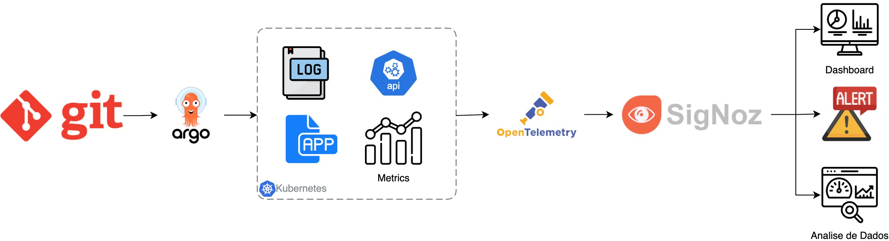
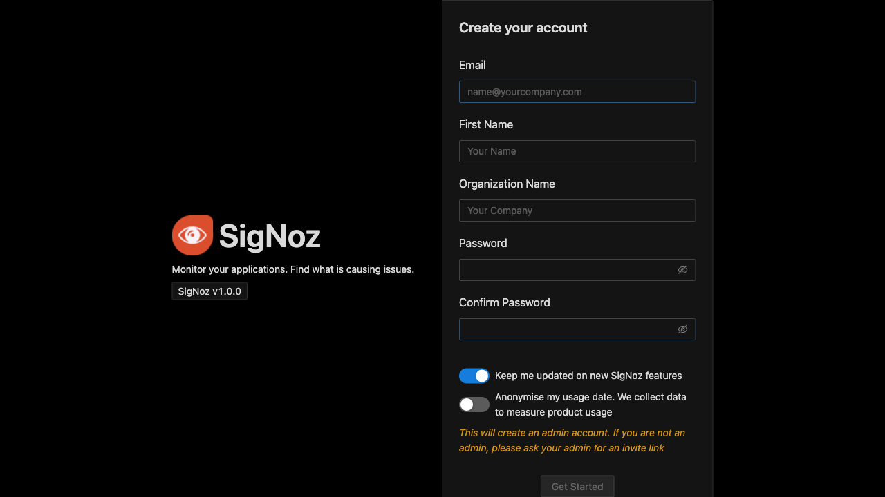
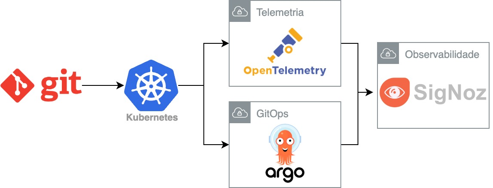
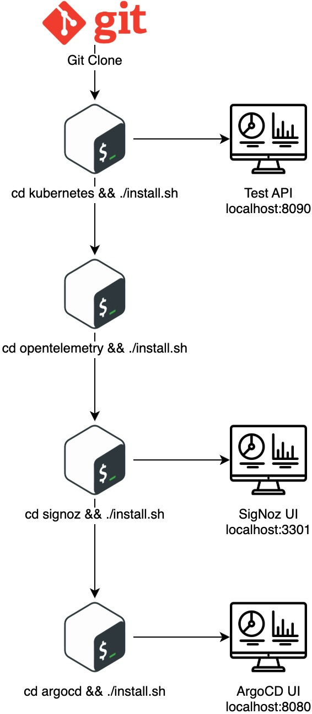
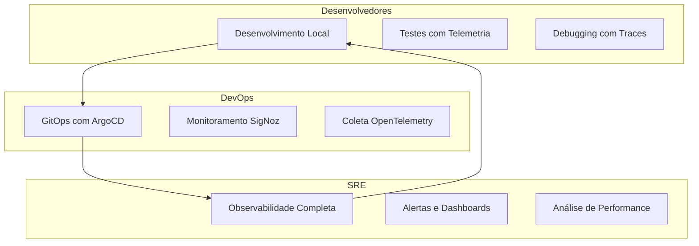
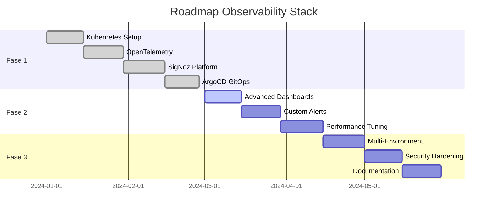

# 🚀 Observability Stack - Solução Completa de Observabilidade


[](https://github.com/SigNoz/signoz)
[](https://kubernetes.io/)
[](https://helm.sh/)
[](https://docker.com/)
[](LICENSE)
[](https://signoz.io/)

## 📋 Visão Geral

Repositório centralizado com **ferramentas e soluções de observabilidade** para Site Reliability Engineering, oferecendo uma stack completa de monitoramento, logging, tracing e gerenciamento de aplicações em ambientes Kubernetes.

### 🎯 Objetivo

Fornecer uma solução **segmentada e modular** de observabilidade que permite:
- **Instalação independente** de cada componente
- **Documentação técnica completa** para cada ferramenta
- **Scripts automatizados** para instalação e gerenciamento
- **Exemplos práticos** de integração e uso

---

## 🏗️ Arquitetura do Sistema



## Interface principal do Observability Stack


*Interface principal do Observability Stack*

---

## 🚀 Componentes Disponíveis

### 🔧 Ferramentas Principais

| Componente | Descrição | Documentação | Instalação |
|------------|-----------|--------------|------------|
| **[Kubernetes](kubernetes/)** | Cluster Kind para desenvolvimento | [📖 README](kubernetes/README.md) | `./install.sh` |
| **[ArgoCD](argocd/)** | GitOps e deployment contínuo | [📖 README](argocd/README.md) | `./install.sh` |
| **[OpenTelemetry](opentelemetry/)** | Coleta universal de telemetria | [📖 README](opentelemetry/README.md) | `./install.sh` |
| **[SigNoz](signoz/)** | Plataforma de observabilidade | [📖 README](signoz/README.md) | `./install.sh` |

#### 🎯 Visão Geral dos Componentes



### 📚 Documentação Técnica

| Documento | Descrição | Conteúdo |
|-----------|-----------|----------|
| **[Guia de Instalação](docs/INSTALACAO-COMPLETA.md)** | Instalação passo a passo | Guia completo de implementação |
| **[Especificações Técnicas](docs/ESPECIFICACOES-TECNICAS.md)** | Requisitos e especificações | Hardware, software, dependências |
| **[Documentação Completa](docs/DOCUMENTACAO-COMPLETA.md)** | Guia técnico detalhado | Arquitetura, configurações, troubleshooting |
| **[Mapeamento Técnico](docs/MAPEAMENTO-TECNICO.md)** | Interconexões e dependências | Diagramas, fluxos, integrações |
| **[Resumo Executivo](docs/RESUMO-EXECUTIVO.md)** | Visão de alto nível | Benefícios, ROI, roadmap |
| **[Índice da Documentação](docs/INDICE-DOCUMENTACAO.md)** | Navegação organizada | Referências e links |

### 🧪 Exemplos e Testes

| Componente | Descrição | Arquivos |
|-------------|-----------|----------|
| **[Examples](examples/)** | API de exemplo com telemetria | `k8s/*.yaml` |
| **ArgoCD Apps** | Aplicações de exemplo | `examples/k8s/argocd-app-*.yaml` |
| **Kustomize** | Configurações por ambiente | `examples/k8s/base/`, `examples/k8s/overlays/` |

---

## 🛠️ Instalação Rápida

### 📋 Pré-requisitos

- **Docker** (versão 20.10+)
- **kubectl** (versão 1.24+)
- **Helm** (versão 3.8+)
- **Git** (versão 2.30+)
- **4GB RAM** mínimo
- **10GB espaço** em disco

### 🚀 Instalação Sequencial

```bash
# 1. Clone o repositório
git clone <seu-repositorio>
cd Observability-Stack

# 2. Instalar Kubernetes local
cd kubernetes
./install.sh

# 3. Instalar OpenTelemetry
cd ../opentelemetry
./install.sh

# 4. Instalar SigNoz
cd ../signoz
./install.sh

# 5. Instalar ArgoCD
cd ../argocd
./install.sh
```

#### 📊 Fluxo de Instalação



### ⚡ Instalação Individual

```bash
# Kubernetes Local
cd kubernetes && ./install.sh

# OpenTelemetry
cd opentelemetry && ./install.sh

# SigNoz
cd signoz && ./install.sh

# ArgoCD
cd argocd && ./install.sh
```

---

## 📊 Acesso aos Serviços

### 🌐 URLs de Acesso

| Serviço | URL | Credenciais |
|---------|-----|-------------|
| **SigNoz UI** | http://localhost:3301 | Acesso direto |
| **ArgoCD UI** | https://localhost:8080 | admin / [senha gerada] |
| **Test API** | http://localhost:8080 | Acesso direto |

### 🔧 Comandos de Port-Forward

```bash
# SigNoz
kubectl port-forward -n platform svc/signoz 3301:8080

# ArgoCD
kubectl port-forward svc/argocd-server -n argocd 8080:443

# Test API
kubectl port-forward svc/test-api-telemetry-service -n test-api 8080:8000
```

---

## 📚 Documentação Completa

### 📖 Documentação Principal

| Documento | Descrição | Público-Alvo |
|-----------|-----------|--------------|
| **[Guia de Instalação](docs/INSTALACAO-COMPLETA.md)** | Instalação passo a passo | DevOps, SRE |
| **[Especificações Técnicas](docs/ESPECIFICACOES-TECNICAS.md)** | Requisitos e especificações | Arquitetos, SRE |
| **[Documentação Completa](docs/DOCUMENTACAO-COMPLETA.md)** | Guia técnico detalhado | Desenvolvedores, DevOps |
| **[Mapeamento Técnico](docs/MAPEAMENTO-TECNICO.md)** | Interconexões e dependências | Arquitetos, SRE |
| **[Resumo Executivo](docs/RESUMO-EXECUTIVO.md)** | Visão de alto nível | Gestores, Stakeholders |
| **[Índice da Documentação](docs/INDICE-DOCUMENTACAO.md)** | Navegação organizada | Todos |

---

## 📚 Documentação Detalhada

### 🎯 Por Ferramenta

- **[Kubernetes](kubernetes/README.md)** - Cluster Kind para desenvolvimento
- **[ArgoCD](argocd/README.md)** - GitOps e deployment contínuo
- **[OpenTelemetry](opentelemetry/README.md)** - Coleta de telemetria
- **[SigNoz](signoz/README.md)** - Plataforma de observabilidade

### 📖 Documentação Técnica

- **[Documentação Completa](docs/DOCUMENTACAO-COMPLETA.md)** - Guia técnico detalhado
- **[Especificações Técnicas](docs/ESPECIFICACOES-TECNICAS.md)** - Requisitos e especificações
- **[Mapeamento Técnico](docs/MAPEAMENTO-TECNICO.md)** - Interconexões e dependências
- **[Resumo Executivo](docs/RESUMO-EXECUTIVO.md)** - Visão de alto nível
- **[Guia de Instalação](docs/INSTALACAO-COMPLETA.md)** - Instalação passo a passo
- **[Índice da Documentação](docs/INDICE-DOCUMENTACAO.md)** - Navegação organizada

---

## 🔧 Gerenciamento e Operação

### 📊 Comandos Úteis

```bash
# Verificar status do cluster
kubectl get nodes
kubectl get pods --all-namespaces

# Verificar serviços
kubectl get svc --all-namespaces

# Logs dos componentes
kubectl logs -n platform -l app.kubernetes.io/name=signoz
kubectl logs -n argocd -l app.kubernetes.io/name=argocd-server
```

### 🧹 Limpeza

```bash
# Remover cluster Kind
kind delete cluster --name observability

# Remover namespaces
kubectl delete namespace platform argocd cert-manager test-api
```

---

## 🎯 Casos de Uso

### 👨‍💻 Para Desenvolvedores
- **Desenvolvimento local** com observabilidade completa
- **Testes de integração** com telemetria
- **Debugging** com traces e logs

### 🔧 Para DevOps
- **GitOps** com ArgoCD
- **Monitoramento** com SigNoz
- **Coleta de telemetria** com OpenTelemetry

### 📊 Para SRE
- **Observabilidade completa** (métricas, logs, traces)
- **Alertas** e dashboards
- **Análise de performance**

#### 🎯 Fluxo de Trabalho por Perfil



---

## 🗺️ Roadmap

### 📅 Próximas Versões



---

## 🤝 Contribuição

### 📝 Como Contribuir

1. **Fork** o repositório
2. **Crie** uma branch para sua feature
3. **Atualize** a documentação
4. **Teste** as mudanças
5. **Abra** um Pull Request

### 📋 Padrões de Documentação

- **Markdown** como formato padrão
- **Estrutura consistente** em todos os READMEs
- **Exemplos práticos** e testados
- **Diagramas** para visualização

---

## 📄 Licença

Este projeto está sob a licença **MIT**. Veja o arquivo [LICENSE](LICENSE) para detalhes.

---

## 🆘 Suporte

### 📞 Contato
- **Issues**: Use o sistema de issues do GitHub
- **Discussões**: Use as discussões do repositório
- **Email**: Para questões urgentes

### 📚 Recursos Adicionais
- **Wiki**: Documentação colaborativa
- **FAQ**: Perguntas frequentes
- **Changelog**: Histórico de mudanças

---

**Versão**: 1.0.0  
**Última atualização**: $(date +%Y-%m-%d)  
**Status**: ✅ Documentação Completa
