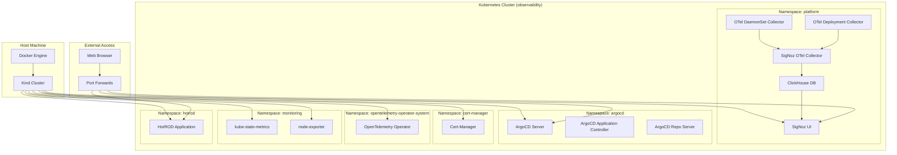

# 📚 Documentação Completa - Ambiente de Observabilidade Segmentado

## 🎯 Visão Geral

Este documento mapeia, documenta e especifica todas as configurações realizadas no ambiente de observabilidade segmentado, incluindo Kubernetes local, SigNoz, OpenTelemetry Operator, ArgoCD e todos os componentes relacionados.

## 📋 Índice

1. [Arquitetura do Sistema](#arquitetura-do-sistema)
2. [Estrutura de Repositórios](#estrutura-de-repositórios)
3. [Configurações do Kubernetes](#configurações-do-kubernetes)
4. [Configurações do SigNoz](#configurações-do-signoz)
5. [Configurações do OpenTelemetry](#configurações-do-opentelemetry)
6. [Configurações do ArgoCD](#configurações-do-argocd)
7. [Configurações de RBAC](#configurações-de-rbac)
8. [Configurações de Rede](#configurações-de-rede)
9. [Configurações de Monitoramento](#configurações-de-monitoramento)
10. [Scripts de Gerenciamento](#scripts-de-gerenciamento)
11. [Troubleshooting](#troubleshooting)

---

## 🏗️ Arquitetura do Sistema

### Diagrama de Arquitetura



### Componentes Principais

| Componente | Namespace | Função | Status |
|------------|-----------|--------|--------|
| **Kind Cluster** | - | Cluster Kubernetes local | ✅ Ativo |
| **SigNoz** | platform | Plataforma de observabilidade | ✅ Ativo |
| **OpenTelemetry Operator** | opentelemetry-operator-system | Gerencia collectors OTel | ✅ Ativo |
| **ArgoCD** | argocd | GitOps e deployment | ✅ Ativo |
| **Cert-Manager** | cert-manager | Gerenciamento de certificados | ✅ Ativo |
| **Métricas** | monitoring | Coleta de métricas K8s | ✅ Ativo |
| **HotROD** | hotrod | App de exemplo para traces | ✅ Ativo |

---

## 📁 Estrutura de Repositórios

### Organização dos Repositórios

```
/home/danilo-reis/devops/repo/observabilidade-segmentado/
├── k8s-local/                    # Kubernetes Local (Kind)
│   ├── install.sh               # Script de instalação do Kind
│   └── README.md                # Documentação do K8s local
├── signoz/                      # SigNoz
│   ├── install.sh               # Script de instalação do SigNoz
│   └── README.md                # Documentação do SigNoz
├── opentelemetry/               # OpenTelemetry
│   ├── install.sh               # Script de instalação do OTel Operator
│   ├── rbac-daemonset.yaml      # RBAC para DaemonSet
│   ├── rbac-deployment.yaml     # RBAC para Deployment
│   ├── collector-daemonset.yaml # Configuração DaemonSet
│   ├── collector-deployment.yaml# Configuração Deployment
│   └── README.md                # Documentação do OpenTelemetry
├── argocd/                      # ArgoCD
│   ├── install.sh               # Script de instalação do ArgoCD
│   └── README.md                # Documentação do ArgoCD
├── gerenciamento/               # Scripts de Gerenciamento
│   ├── install-all.sh           # Instalação completa
│   ├── start.sh                 # Iniciar ambiente
│   ├── stop.sh                  # Parar ambiente
│   ├── status.sh                # Verificar status
│   ├── ACESSO-COMPLETO.md       # Guia de acesso
│   └── README.md                # Documentação de gerenciamento
├── README.md                    # README principal
└── DOCUMENTACAO-COMPLETA.md     # Este documento
```

### Responsabilidades de Cada Repositório

#### 1. `k8s-local/`
- **Responsabilidade**: Instalação e configuração do cluster Kubernetes local
- **Componentes**: Kind, kubectl, cluster `observability`
- **Dependências**: Docker

#### 2. `signoz/`
- **Responsabilidade**: Instalação da plataforma de observabilidade
- **Componentes**: SigNoz UI, ClickHouse, OTel Collector, métricas, HotROD
- **Dependências**: Kubernetes local

#### 3. `opentelemetry/`
- **Responsabilidade**: Instalação e configuração do OpenTelemetry Operator
- **Componentes**: Operator, Collectors (DaemonSet + Deployment), RBAC
- **Dependências**: Kubernetes local, cert-manager

#### 4. `argocd/`
- **Responsabilidade**: Instalação do ArgoCD para GitOps
- **Componentes**: Server, Application Controller, ApplicationSet
- **Dependências**: Kubernetes local

#### 5. `gerenciamento/`
- **Responsabilidade**: Scripts para gerenciar todo o ambiente
- **Componentes**: Scripts de instalação, start, stop, status
- **Dependências**: Todos os outros repositórios

---

## ⚙️ Configurações do Kubernetes

### Cluster Kind

#### Configuração do Cluster
```yaml
# Cluster Name: observability
# Kubernetes Version: Latest stable
# Node Type: Single control-plane node
# Container Runtime: Docker
```

#### Comandos de Instalação
```bash
# Instalar Kind
curl -Lo ./kind https://kind.sigs.k8s.io/dl/v0.23.0/kind-linux-amd64
chmod +x ./kind
sudo mv ./kind /usr/local/bin/kind

# Instalar kubectl
curl -LO "https://dl.k8s.io/release/$(curl -L -s https://dl.k8s.io/release/stable.txt)/bin/linux/amd64/kubectl"
sudo install -o root -g root -m 0755 kubectl /usr/local/bin/kubectl

# Criar cluster
kind create cluster --name observability
```

#### Verificação do Cluster
```bash
# Verificar cluster
kubectl get nodes
kubectl get pods --all-namespaces
kind get clusters
```

### Namespaces Criados

| Namespace | Propósito | Componentes |
|-----------|-----------|-------------|
| `platform` | SigNoz e OpenTelemetry | SigNoz, ClickHouse, OTel Collectors |
| `argocd` | ArgoCD | Server, Application Controller, Repo Server |
| `cert-manager` | Certificados | Cert-Manager |
| `opentelemetry-operator-system` | OpenTelemetry Operator | Operator |
| `monitoring` | Métricas | kube-state-metrics, node-exporter |
| `hotrod` | Aplicação de exemplo | HotROD |

---

## 📊 Configurações do SigNoz

### Instalação via Helm

#### Repositório Helm
```bash
helm repo add signoz https://charts.signoz.io
helm repo update
```

#### Valores de Configuração
```yaml
# Configurações principais do SigNoz
frontend:
  service:
    type: ClusterIP
    port: 8080

otelCollector:
  service:
    type: ClusterIP
    ports:
      grpc: 4317
      http: 4318

clickhouse:
  persistence:
    enabled: true
    size: 10Gi
```

#### Comando de Instalação
```bash
helm install signoz signoz/signoz -n platform
```

### Componentes do SigNoz

#### 1. SigNoz UI
- **Namespace**: `platform`
- **Service**: `signoz`
- **Port**: 8080
- **Acesso**: http://localhost:3301 (via port-forward)

#### 2. ClickHouse Database
- **Namespace**: `platform`
- **Service**: `signoz-clickhouse`
- **Ports**: 8123 (HTTP), 9000 (TCP)
- **Persistência**: 10Gi

#### 3. SigNoz OTel Collector
- **Namespace**: `platform`
- **Service**: `signoz-otel-collector`
- **Ports**: 4317 (gRPC), 4318 (HTTP)
- **Função**: Coleta dados para o SigNoz

#### 4. ZooKeeper
- **Namespace**: `platform`
- **Service**: `signoz-zookeeper`
- **Port**: 2181
- **Função**: Coordenação do ClickHouse

### Configurações de Métricas

#### kube-state-metrics
```yaml
# Instalação via Helm
helm repo add prometheus-community https://prometheus-community.github.io/helm-charts
helm install kube-state-metrics prometheus-community/kube-state-metrics -n monitoring
```

#### node-exporter
```yaml
# Instalação via Helm
helm install node-exporter prometheus-community/prometheus-node-exporter -n monitoring
```

### Aplicação de Exemplo (HotROD)

#### Configuração do HotROD
```yaml
apiVersion: apps/v1
kind: Deployment
metadata:
  name: hotrod
  namespace: hotrod
spec:
  replicas: 1
  selector:
    matchLabels:
      app: hotrod
  template:
    metadata:
      labels:
        app: hotrod
    spec:
      containers:
        - name: hotrod
          image: jaegertracing/example-hotrod:latest
          args: ["all"]
          env:
            - name: OTEL_EXPORTER_OTLP_ENDPOINT
              value: "http://signoz-otel-collector.platform.svc.cluster.local:4318"
            - name: OTEL_SERVICE_NAME
              value: "hotrod"
          ports:
            - name: frontend
              containerPort: 8080
```

---

## 📡 Configurações do OpenTelemetry

### OpenTelemetry Operator

#### Instalação
```bash
# Adicionar repositório
helm repo add open-telemetry https://open-telemetry.github.io/opentelemetry-helm-charts
helm repo update

# Instalar Operator
helm install opentelemetry-operator open-telemetry/opentelemetry-operator \
  --namespace opentelemetry-operator-system \
  --create-namespace
```

#### Verificação
```bash
kubectl get pods -n opentelemetry-operator-system
kubectl get crd | grep opentelemetry
```

### DaemonSet Collector

#### Configuração Completa
```yaml
apiVersion: opentelemetry.io/v1beta1
kind: OpenTelemetryCollector
metadata:
  name: signoz-collector-daemonset
  namespace: platform
spec:
  mode: daemonset
  image: docker.io/otel/opentelemetry-collector-contrib:0.109.0
  env:
    - name: OTEL_EXPORTER_OTLP_ENDPOINT
      value: "signoz-otel-collector.platform.svc.cluster.local:4317"
    - name: K8S_CLUSTER_NAME
      value: "observability"
    # ... outras variáveis de ambiente
  volumes:
    - name: varlog
      hostPath:
        path: /var/log
    - name: hostfs
      hostPath:
        path: /
  volumeMounts:
    - name: varlog
      mountPath: /var/log
      readOnly: true
    - name: hostfs
      mountPath: /hostfs
      readOnly: true
      mountPropagation: HostToContainer
```

#### Receivers Configurados
- **OTLP**: gRPC (4317) e HTTP (4318)
- **filelog/k8s**: Logs de containers
- **hostmetrics**: Métricas de host (CPU, disco, memória, rede)
- **kubeletstats**: Métricas do Kubelet

#### Processors Configurados
- **batch**: Agrupamento de dados
- **k8sattributes**: Enriquecimento com metadados K8s
- **resourcedetection**: Detecção de recursos

#### Exporters Configurados
- **otlp**: Envio para SigNoz
- **debug**: Logs de debug

### Deployment Collector

#### Configuração Completa
```yaml
apiVersion: opentelemetry.io/v1beta1
kind: OpenTelemetryCollector
metadata:
  name: signoz-collector-deployment
  namespace: platform
spec:
  mode: deployment
  image: docker.io/otel/opentelemetry-collector-contrib:0.109.0
  # ... configurações similares ao DaemonSet
```

#### Receivers Configurados
- **k8s_cluster**: Métricas de cluster
- **k8s_events**: Eventos do Kubernetes

#### Pipelines Configurados
- **logs**: Eventos K8s → processamento → SigNoz
- **metrics/internal**: Métricas de cluster → processamento → SigNoz

---

## 🚀 Configurações do ArgoCD

### Instalação via Helm

#### Repositório Helm
```bash
helm repo add argo https://argoproj.github.io/argo-helm
helm repo update
```

#### Configuração de Instalação
```yaml
server:
  service:
    type: ClusterIP
  ingress:
    enabled: false
  extraArgs:
    - --insecure
    - --rootpath
    - "/"

configs:
  params:
    "server.insecure": true
    "server.rootpath": "/"
```

#### Comando de Instalação
```bash
helm install argocd argo/argo-cd \
  --namespace argocd \
  --create-namespace \
  --set server.service.type=ClusterIP \
  --set server.ingress.enabled=false \
  --set configs.params."server\.insecure"=true \
  --set configs.params."server\.rootpath"="/" \
  --set server.extraArgs[0]="--insecure" \
  --set server.extraArgs[1]="--rootpath" \
  --set server.extraArgs[2]="/"
```

### Componentes do ArgoCD

#### 1. ArgoCD Server
- **Namespace**: `argocd`
- **Service**: `argocd-server`
- **Ports**: 80 (HTTP), 443 (HTTPS)
- **Acesso**: https://localhost:8080 (via port-forward)

#### 2. Application Controller
- **Namespace**: `argocd`
- **Função**: Controla o estado das aplicações
- **Replicas**: 1

#### 3. Repo Server
- **Namespace**: `argocd`
- **Função**: Servidor de repositórios Git
- **Replicas**: 1

#### 4. ApplicationSet Controller
- **Namespace**: `argocd`
- **Função**: Gerencia múltiplas aplicações
- **Replicas**: 1

### ApplicationSet para Observabilidade

#### Configuração
```yaml
apiVersion: argoproj.io/v1alpha1
kind: ApplicationSet
metadata:
  name: observability-apps
  namespace: argocd
spec:
  generators:
  - list:
      elements:
      - name: signoz
        namespace: platform
        repoURL: https://charts.signoz.io
        chart: signoz
        targetRevision: "0.0.50"
      - name: prometheus
        namespace: monitoring
        repoURL: https://prometheus-community.github.io/helm-charts
        chart: kube-state-metrics
        targetRevision: "5.9.2"
      # ... outras aplicações
```

### Credenciais de Acesso

#### Obter Senha do Admin
```bash
kubectl -n argocd get secret argocd-initial-admin-secret -o jsonpath="{.data.password}" | base64 -d
```

#### Login via CLI (se instalado)
```bash
argocd login localhost:8080 --insecure
```

---

## 🔐 Configurações de RBAC

### RBAC para DaemonSet Collector

#### ClusterRole
```yaml
apiVersion: rbac.authorization.k8s.io/v1
kind: ClusterRole
metadata:
  name: signoz-collector-daemonset-collector-role
  namespace: platform
rules:
  - apiGroups: [""]
    resources: [pods, namespaces, nodes, persistentvolumeclaims]
    verbs: [get, list, watch]
  - apiGroups: ["apps"]
    resources: [replicasets]
    verbs: [get, list, watch]
  - apiGroups: [""]
    resources: [nodes/proxy]
    verbs: [get]
  - apiGroups: [""]
    resources: [nodes/stats, configmaps, events]
    verbs: [create, get]
```

#### ClusterRoleBinding
```yaml
apiVersion: rbac.authorization.k8s.io/v1
kind: ClusterRoleBinding
metadata:
  name: signoz-collector-daemonset-collector-binding
  namespace: platform
roleRef:
  apiGroup: rbac.authorization.k8s.io
  kind: ClusterRole
  name: signoz-collector-daemonset-collector-role
subjects:
  - kind: ServiceAccount
    name: signoz-collector-daemonset-collector
    namespace: platform
```

### RBAC para Deployment Collector

#### ClusterRole
```yaml
apiVersion: rbac.authorization.k8s.io/v1
kind: ClusterRole
metadata:
  name: signoz-collector-deployment-collector-role
  namespace: platform
rules:
  - apiGroups: [""]
    resources: [events, namespaces, namespaces/status, nodes, nodes/spec, pods, pods/status, replicationcontrollers, replicationcontrollers/status, resourcequotas, services]
    verbs: [get, list, watch]
  - apiGroups: ["apps"]
    resources: [daemonsets, deployments, replicasets, statefulsets]
    verbs: [get, list, watch]
  - apiGroups: ["batch"]
    resources: [jobs, cronjobs]
    verbs: [get, list, watch]
  - apiGroups: ["autoscaling"]
    resources: [horizontalpodautoscalers]
    verbs: [get, list, watch]
```

#### ClusterRoleBinding
```yaml
apiVersion: rbac.authorization.k8s.io/v1
kind: ClusterRoleBinding
metadata:
  name: signoz-collector-deployment-collector-binding
  namespace: platform
roleRef:
  apiGroup: rbac.authorization.k8s.io
  kind: ClusterRole
  name: signoz-collector-deployment-collector-role
subjects:
  - kind: ServiceAccount
    name: signoz-collector-deployment-collector
    namespace: platform
```

---

## 🌐 Configurações de Rede

### Port-Forwards Configurados

| Serviço | Namespace | Porta Local | Porta Remota | Protocolo | Acesso |
|---------|-----------|-------------|--------------|-----------|--------|
| **SigNoz** | platform | 3301 | 8080 | HTTP | http://localhost:3301 |
| **ArgoCD** | argocd | 8080 | 443 | HTTPS | https://localhost:8080 |
| **HotROD** | hotrod | 8081 | 8080 | HTTP | http://localhost:8081 |

### Comandos de Port-Forward

#### SigNoz
```bash
kubectl port-forward -n platform svc/signoz 3301:8080
```

#### ArgoCD
```bash
kubectl port-forward svc/argocd-server -n argocd 8080:443
```

#### HotROD
```bash
kubectl port-forward svc/hotrod -n hotrod 8081:8080
```

### Serviços Internos

#### Comunicação entre Pods
- **SigNoz OTel Collector**: `signoz-otel-collector.platform.svc.cluster.local:4317`
- **ClickHouse**: `signoz-clickhouse.platform.svc.cluster.local:8123`
- **ZooKeeper**: `signoz-zookeeper.platform.svc.cluster.local:2181`

#### Endpoints OTLP
- **gRPC**: `signoz-otel-collector.platform.svc.cluster.local:4317`
- **HTTP**: `signoz-otel-collector.platform.svc.cluster.local:4318`

---

## 📈 Configurações de Monitoramento

### Métricas Coletadas

#### Métricas de Host (via DaemonSet)
- **CPU**: Uso, tempo de sistema, tempo de usuário
- **Disco**: Uso, I/O, espaço livre
- **Memória**: Uso, swap, buffers
- **Rede**: Tráfego, conexões, erros
- **Filesystem**: Uso, inodes, montagens

#### Métricas do Kubernetes (via DaemonSet)
- **Container**: CPU, memória, restart count
- **Pod**: CPU, memória, status, uptime
- **Node**: CPU, memória, condições
- **Volume**: Uso, capacidade, status

#### Métricas de Cluster (via Deployment)
- **Node Conditions**: Ready, MemoryPressure, DiskPressure
- **Pod Status**: Status reasons, restart counts
- **Resource Quotas**: CPU, memória alocáveis
- **Events**: Eventos do cluster

#### Logs Coletados
- **Container Logs**: Todos os pods (exceto system pods)
- **Kubernetes Events**: Eventos do cluster
- **Application Logs**: Logs de aplicações

### Alertas Configurados

#### Alertas Básicos (via SigNoz UI)
- **High CPU Usage**: > 80% por 5 minutos
- **High Memory Usage**: > 85% por 5 minutos
- **Pod Restart**: > 3 restarts em 10 minutos
- **Disk Space**: > 90% de uso

#### Configuração de Alertas
```yaml
# Exemplo de alerta no SigNoz
name: "High CPU Usage"
condition: "cpu_usage > 80"
duration: "5m"
severity: "warning"
```

---

## 🔧 Scripts de Gerenciamento

### Scripts Disponíveis

#### 1. `install-all.sh`
```bash
#!/usr/bin/env bash
# Instala todos os componentes em sequência
# - Kubernetes Local (Kind)
# - OpenTelemetry Operator
# - SigNoz
# - ArgoCD
```

#### 2. `start.sh`
```bash
#!/usr/bin/env bash
# Inicia o ambiente verificando dependências
# - Verifica Docker
# - Verifica cluster Kind
# - Instala componentes se necessário
# - Aguarda pods ficarem prontos
```

#### 3. `stop.sh`
```bash
#!/usr/bin/env bash
# Para o ambiente completamente
# - Para port-forwards
# - Remove recursos K8s
# - Remove namespaces
# - Opção de parar cluster Kind
# - Opção de parar Docker
```

#### 4. `status.sh`
```bash
#!/usr/bin/env bash
# Verifica status de todos os componentes
# - Docker
# - Cluster Kind
# - SigNoz
# - ArgoCD
# - OpenTelemetry
# - Port-forwards
# - Acessos
```

### Funções dos Scripts

#### Verificações Realizadas
- **Docker**: Status do daemon
- **Kind**: Existência do cluster
- **kubectl**: Configuração do contexto
- **Pods**: Status de todos os pods
- **Services**: Status dos serviços
- **Port-forwards**: Processos ativos
- **Acessos**: Conectividade HTTP/HTTPS

#### Logs e Output
- **Cores**: Verde (sucesso), Amarelo (aviso), Vermelho (erro), Azul (info)
- **Timestamps**: Todas as mensagens com timestamp
- **Progresso**: Indicadores de progresso
- **Resumo**: Status final consolidado

---

## 🚨 Troubleshooting

### Problemas Comuns e Soluções

#### 1. Docker não está rodando
```bash
# Verificar status
sudo systemctl status docker

# Iniciar Docker
sudo systemctl start docker

# Verificar permissões
sudo usermod -aG docker $USER
# (Requer logout/login)
```

#### 2. Cluster Kind não encontrado
```bash
# Verificar clusters
kind get clusters

# Recriar cluster
kind delete cluster --name observability
kind create cluster --name observability
```

#### 3. Port-forward não funciona
```bash
# Verificar processos
ps aux | grep "kubectl port-forward"

# Parar processos
pkill -f "kubectl port-forward"

# Reiniciar port-forwards
kubectl port-forward -n platform svc/signoz 3301:8080 &
kubectl port-forward svc/argocd-server -n argocd 8080:443 &
kubectl port-forward svc/hotrod -n hotrod 8081:8080 &
```

#### 4. Pods não ficam prontos
```bash
# Verificar status dos pods
kubectl get pods --all-namespaces

# Verificar logs
kubectl logs -n <namespace> <pod-name>

# Verificar eventos
kubectl get events --all-namespaces --sort-by='.lastTimestamp'

# Descrever pod
kubectl describe pod -n <namespace> <pod-name>
```

#### 5. Problemas de RBAC
```bash
# Verificar ServiceAccounts
kubectl get serviceaccounts --all-namespaces

# Verificar ClusterRoles
kubectl get clusterroles | grep signoz

# Verificar ClusterRoleBindings
kubectl get clusterrolebindings | grep signoz

# Verificar permissões
kubectl auth can-i list pods --as=system:serviceaccount:platform:signoz-collector-daemonset-collector
```

#### 6. SigNoz não acessível
```bash
# Verificar pod do SigNoz
kubectl get pods -n platform -l app.kubernetes.io/name=signoz

# Verificar logs
kubectl logs -n platform -l app.kubernetes.io/name=signoz

# Verificar serviço
kubectl get svc -n platform signoz

# Testar conectividade
kubectl port-forward -n platform svc/signoz 3301:8080 &
curl -I http://localhost:3301
```

#### 7. OpenTelemetry Collectors com erro
```bash
# Verificar collectors
kubectl get opentelemetrycollector -n platform

# Verificar pods
kubectl get pods -n platform -l app.kubernetes.io/name=opentelemetry-collector

# Verificar logs
kubectl logs -n platform -l app.kubernetes.io/name=opentelemetry-collector

# Verificar configuração
kubectl describe opentelemetrycollector -n platform <collector-name>
```

### Comandos de Diagnóstico

#### Verificação Geral
```bash
# Status completo
./status.sh

# Pods em todos os namespaces
kubectl get pods --all-namespaces

# Serviços
kubectl get svc --all-namespaces

# OpenTelemetry Collectors
kubectl get opentelemetrycollector --all-namespaces

# Port-forwards ativos
ps aux | grep "kubectl port-forward"
```

#### Logs Importantes
```bash
# Logs do SigNoz
kubectl logs -n platform -l app.kubernetes.io/name=signoz

# Logs do OpenTelemetry Operator
kubectl logs -n opentelemetry-operator-system -l app.kubernetes.io/name=opentelemetry-operator

# Logs dos Collectors
kubectl logs -n platform -l app.kubernetes.io/name=opentelemetry-collector

# Logs do ArgoCD
kubectl logs -n argocd -l app.kubernetes.io/name=argocd-server
```

#### Limpeza Completa
```bash
# Parar ambiente
./stop.sh

# Remover cluster Kind
kind delete cluster --name observability

# Limpar Docker
docker system prune -a

# Recriar ambiente
./install-all.sh
```

---

## 📊 Resumo das Configurações

### Estatísticas do Ambiente

| Métrica | Valor |
|---------|-------|
| **Pods Totais** | 31/33 rodando |
| **Namespaces** | 6 ativos |
| **OpenTelemetry Collectors** | 2 (DaemonSet + Deployment) |
| **Port-forwards** | 3 ativos |
| **Serviços** | 19 serviços |
| **RBAC Rules** | 2 ClusterRoles + 2 ClusterRoleBindings |

### Componentes por Namespace

| Namespace | Pods | Serviços | Função |
|-----------|------|----------|--------|
| `platform` | 9 | 9 | SigNoz + OpenTelemetry |
| `argocd` | 7 | 5 | GitOps |
| `cert-manager` | 3 | 1 | Certificados |
| `opentelemetry-operator-system` | 1 | 0 | Operator |
| `monitoring` | 2 | 2 | Métricas |
| `hotrod` | 1 | 1 | App de exemplo |

### Recursos Utilizados

| Recurso | Uso Estimado |
|---------|--------------|
| **CPU** | ~2-3 cores |
| **Memória** | ~4-6 GB |
| **Disco** | ~15-20 GB |
| **Rede** | Portas 3301, 8080, 8081 |

---

## 🎯 Próximos Passos

### Melhorias Sugeridas

1. **Alertas Avançados**: Configurar alertas mais específicos no SigNoz
2. **Dashboards**: Criar dashboards personalizados
3. **Backup**: Configurar backup do ClickHouse
4. **SSL/TLS**: Configurar certificados para produção
5. **Ingress**: Configurar ingress para acesso externo
6. **Monitoring**: Adicionar Prometheus/Grafana
7. **Logging**: Configurar log aggregation avançada

### Expansão do Ambiente

1. **Multi-node**: Expandir para cluster multi-node
2. **Persistent Storage**: Configurar storage persistente
3. **Load Balancing**: Configurar load balancer
4. **High Availability**: Configurar HA para componentes críticos
5. **Security**: Implementar políticas de segurança
6. **Compliance**: Adicionar auditoria e compliance

---

## 📞 Suporte e Contato

### Documentação Adicional

- **SigNoz**: https://signoz.io/docs/
- **OpenTelemetry**: https://opentelemetry.io/docs/
- **ArgoCD**: https://argo-cd.readthedocs.io/
- **Kubernetes**: https://kubernetes.io/docs/
- **Kind**: https://kind.sigs.k8s.io/

### Comandos de Emergência

```bash
# Parar tudo
./stop.sh

# Reiniciar tudo
./stop.sh && ./start.sh

# Status completo
./status.sh

# Logs de todos os componentes
kubectl logs --all-namespaces --all-containers=true --since=1h
```

---

**Documentação criada em**: 22 de Setembro de 2025  
**Versão**: 1.0  
**Ambiente**: observabilidade-segmentado  
**Status**: ✅ Completo e Funcional
