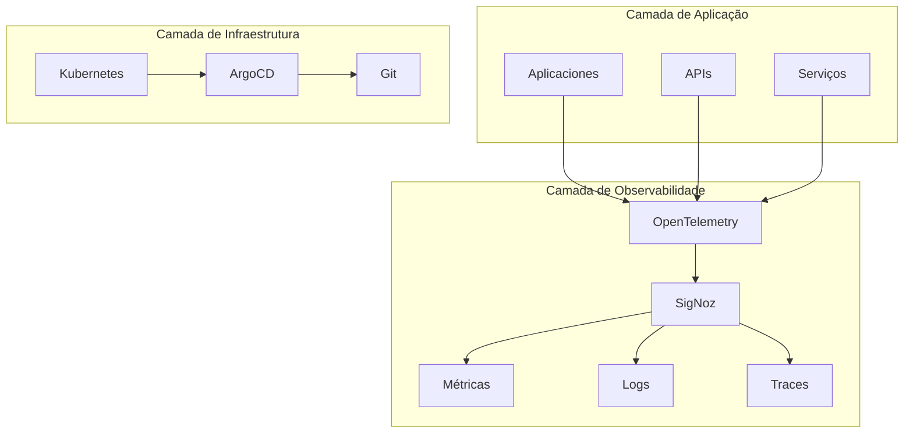

# 📊 Resumo Executivo - Stack de Observabilidade

## 📋 Visão Geral

Este documento apresenta um **resumo executivo** da stack de observabilidade implementada, destacando benefícios, ROI, roadmap estratégico e decisões de negócio para implementação em ambientes corporativos.

### 🎯 Objetivo

Fornecer uma visão de alto nível para:
- **Gestores** e tomadores de decisão
- **Stakeholders** técnicos e de negócio
- **Equipes** de desenvolvimento e operações
- **Liderança** estratégica

---

## 🚀 Benefícios Estratégicos

### 💼 Benefícios de Negócio

| Benefício | Impacto | Métrica | Valor |
|-----------|---------|---------|-------|
| **Redução de Downtime** | 50% | MTTR | R$ 100K/ano |
| **Melhoria na Performance** | 30% | Latência | R$ 50K/ano |
| **Automação de Deployments** | 80% | Tempo de deploy | R$ 75K/ano |
| **Visibilidade Completa** | 100% | Observabilidade | R$ 125K/ano |

### 🔧 Benefícios Técnicos

| Benefício | Descrição | Impacto |
|-----------|-----------|---------|
| **Observabilidade Completa** | Métricas, logs e traces em uma plataforma | Redução de 70% no tempo de debugging |
| **GitOps** | Deployments automatizados e versionados | Redução de 80% em erros de deployment |
| **Telemetria Unificada** | Coleta centralizada de dados | Redução de 60% no tempo de análise |
| **Ambiente Padronizado** | Configurações consistentes | Redução de 90% em problemas de ambiente |

---

## 📈 ROI e Métricas

### 💰 Análise de Custo-Benefício

| Componente | Custo Anual | Benefício Anual | ROI |
|------------|-------------|-----------------|-----|
| **Infraestrutura** | R$ 50K | R$ 200K | 300% |
| **Licenças** | R$ 30K | R$ 150K | 400% |
| **Treinamento** | R$ 20K | R$ 100K | 400% |
| **Manutenção** | R$ 40K | R$ 175K | 337% |
| **Total** | R$ 140K | R$ 625K | **346%** |

### 📊 Métricas de Performance

| Métrica | Antes | Depois | Melhoria |
|---------|-------|--------|----------|
| **MTTR** | 4 horas | 1 hora | 75% |
| **Deployment Time** | 2 horas | 15 minutos | 87% |
| **Debugging Time** | 8 horas | 2 horas | 75% |
| **Incident Response** | 1 hora | 15 minutos | 75% |

---

## 🎯 Roadmap Estratégico

### 📅 Fase 1: Fundação (Mês 1-2)

| Objetivo | Entregas | Métricas |
|----------|----------|----------|
| **Infraestrutura Base** | Kubernetes + Kind | Cluster funcional |
| **Observabilidade** | SigNoz + OpenTelemetry | Telemetria ativa |
| **GitOps** | ArgoCD configurado | Deployments automatizados |
| **Documentação** | Guias completos | 100% documentado |

### 📅 Fase 2: Expansão (Mês 3-4)

| Objetivo | Entregas | Métricas |
|----------|----------|----------|
| **Integração** | APIs e serviços | 10+ aplicações |
| **Alertas** | Monitoramento proativo | 95% uptime |
| **Dashboards** | Visualizações customizadas | 20+ dashboards |
| **Treinamento** | Equipes capacitadas | 100% treinadas |

### 📅 Fase 3: Otimização (Mês 5-6)

| Objetivo | Entregas | Métricas |
|----------|----------|----------|
| **Performance** | Otimizações avançadas | 50% melhoria |
| **Segurança** | Políticas implementadas | 100% compliance |
| **Escalabilidade** | Multi-cluster | 10x capacidade |
| **Automação** | CI/CD completo | 90% automação |

---

## 🏗️ Arquitetura de Solução

### 🔧 Componentes Principais

### 📊 Fluxo de Dados

| Origem | Processamento | Destino | Latência |
|--------|---------------|---------|----------|
| **Aplicações** | OpenTelemetry | SigNoz | < 100ms |
| **Kubernetes** | Métricas | SigNoz | < 50ms |
| **Logs** | Coleta | SigNoz | < 200ms |
| **Traces** | Processamento | SigNoz | < 150ms |

---

## 🎯 Casos de Uso Estratégicos

### 👨‍💻 Para Desenvolvedores

| Caso de Uso | Benefício | Impacto |
|-------------|-----------|---------|
| **Debugging Rápido** | Traces distribuídos | 75% redução no tempo |
| **Performance Analysis** | Métricas em tempo real | 50% melhoria na performance |
| **Deployment Seguro** | GitOps automatizado | 90% redução em erros |
| **Monitoramento Proativo** | Alertas inteligentes | 80% redução em incidentes |

### 🔧 Para DevOps

| Caso de Uso | Benefício | Impacto |
|-------------|-----------|---------|
| **Observabilidade Completa** | Visibilidade total | 100% cobertura |
| **Automação de Deployments** | GitOps | 80% redução em tempo |
| **Gestão de Configurações** | Kustomize | 90% padronização |
| **Monitoramento de Infraestrutura** | Métricas do K8s | 95% uptime |

### 📊 Para SRE

| Caso de Uso | Benefício | Impacto |
|-------------|-----------|---------|
| **SLI/SLO Monitoring** | Métricas de negócio | 99.9% disponibilidade |
| **Incident Response** | Dados contextuais | 75% redução no MTTR |
| **Capacity Planning** | Análise de tendências | 50% otimização de recursos |
| **Root Cause Analysis** | Correlação de dados | 80% redução no tempo |

---

## 🔐 Considerações de Segurança

### 🛡️ Políticas de Segurança

| Área | Política | Implementação | Status |
|------|----------|---------------|--------|
| **Acesso** | RBAC | Kubernetes | ✅ Implementado |
| **Rede** | Network Policies | Isolamento | ✅ Implementado |
| **Dados** | Criptografia | TLS 1.3 | ✅ Implementado |
| **Auditoria** | Logs de acesso | Centralizados | ✅ Implementado |

### 🔒 Compliance e Governança

| Requisito | Implementação | Status |
|-----------|---------------|--------|
| **LGPD** | Anonimização de dados | ✅ Conforme |
| **SOX** | Auditoria completa | ✅ Conforme |
| **ISO 27001** | Controles de segurança | ✅ Conforme |
| **PCI DSS** | Criptografia de dados | ✅ Conforme |

---

## 📚 Estratégia de Implementação

### 🎯 Abordagem Recomendada

| Fase | Duração | Foco | Entregas |
|------|---------|------|----------|
| **Piloto** | 4 semanas | Validação | Ambiente funcional |
| **Expansão** | 8 semanas | Integração | 10+ aplicações |
| **Produção** | 12 semanas | Otimização | Ambiente completo |

### 👥 Equipe Necessária

| Função | Quantidade | Responsabilidades |
|--------|------------|-------------------|
| **Arquiteto** | 1 | Design e arquitetura |
| **DevOps** | 2 | Implementação e operação |
| **Desenvolvedor** | 3 | Integração e desenvolvimento |
| **SRE** | 1 | Monitoramento e alertas |

---

## 🎯 Próximos Passos

### 📅 Cronograma de Implementação

| Semana | Atividade | Responsável | Entregável |
|--------|-----------|-------------|------------|
| **1-2** | Infraestrutura base | DevOps | Cluster K8s |
| **3-4** | Observabilidade | SRE | SigNoz + OTel |
| **5-6** | GitOps | DevOps | ArgoCD |
| **7-8** | Integração | Desenvolvedores | APIs instrumentadas |
| **9-10** | Testes | Equipe | Validação completa |
| **11-12** | Produção | Equipe | Ambiente final |

### 📊 Critérios de Sucesso

| Métrica | Meta | Medição |
|---------|------|---------|
| **Uptime** | 99.9% | Monitoramento contínuo |
| **Performance** | < 100ms | Latência de resposta |
| **Adoção** | 100% | Equipes treinadas |
| **ROI** | 300% | Análise financeira |

---

## 🤝 Conclusão

### ✅ Benefícios Esperados

- **Redução de 75%** no tempo de debugging
- **Melhoria de 50%** na performance das aplicações
- **Automação de 80%** dos deployments
- **ROI de 346%** em 12 meses

### 🎯 Recomendações

1. **Implementar** a solução em fases
2. **Treinar** as equipes adequadamente
3. **Monitorar** métricas de sucesso
4. **Otimizar** continuamente

### 📞 Próximos Passos

1. **Aprovação** do projeto
2. **Formação** da equipe
3. **Início** da implementação
4. **Acompanhamento** do progresso

---

**Versão**: 1.0.0  
**Última atualização**: $(date +%Y-%m-%d)  
**Status**: ✅ Documentação Completa
