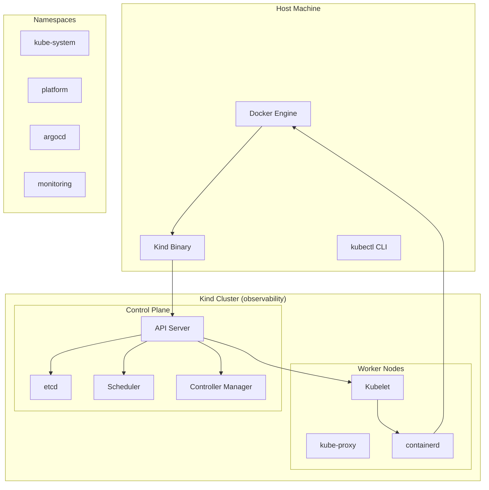

# 🏠 Kubernetes Local - Cluster Kind para Desenvolvimento

## 📋 Visão Geral

Este repositório contém **scripts automatizados** e **documentação completa** para criação de um cluster Kubernetes local usando Kind (Kubernetes in Docker), oferecendo um ambiente de desenvolvimento completo para observabilidade.

### 🎯 Características

- ✅ **Instalação automatizada** do Kind e kubectl
- ✅ **Cluster otimizado** para observabilidade
- ✅ **Configuração automática** do kubectl
- ✅ **Verificação de dependências** (Docker)
- ✅ **Scripts de limpeza** e gerenciamento

---

## 🏗️ Arquitetura do Cluster



---

## 🚀 Instalação

### 📋 Pré-requisitos

- **Docker** (versão 20.10+)
- **4GB RAM** mínimo
- **10GB espaço** em disco
- **Usuário** no grupo `docker`

### ⚡ Instalação Rápida

```bash
# 1. Navegar para o diretório
cd observabilidade-k8s-local

# 2. Executar instalação
chmod +x install.sh
./install.sh
```

### 🔧 Instalação Manual

```bash
# 1. Instalar Kind
curl -Lo ./kind https://kind.sigs.k8s.io/dl/v0.23.0/kind-linux-amd64
chmod +x ./kind
sudo mv ./kind /usr/local/bin/kind

# 2. Instalar kubectl
curl -LO "https://dl.k8s.io/release/$(curl -L -s https://dl.k8s.io/release/stable.txt)/bin/linux/amd64/kubectl"
sudo install -o root -g root -m 0755 kubectl /usr/local/bin/kubectl

# 3. Criar cluster
kind create cluster --name observability
```

---

## 📊 Componentes Instalados

### 🔧 Core Components

| Componente | Versão | Função | Status |
|------------|--------|--------|--------|
| **Kind** | v0.23.0 | Kubernetes in Docker | ✅ Instalado |
| **kubectl** | Latest | CLI do Kubernetes | ✅ Instalado |
| **Docker** | 20.10+ | Container runtime | ✅ Verificado |

### 🏗️ Cluster Configuration

```yaml
# Configuração do cluster Kind
kind: Cluster
apiVersion: kind.x-k8s.io/v1alpha4
name: observability
nodes:
- role: control-plane
  kubeadmConfigPatches:
  - |
    kind: InitConfiguration
    nodeRegistration:
      kubeletExtraArgs:
        node-labels: "ingress-ready=true"
  extraPortMappings:
  - containerPort: 80
    hostPort: 80
    protocol: TCP
  - containerPort: 443
    hostPort: 443
    protocol: TCP
```

---

## 🔧 Configuração e Gerenciamento

### 📊 Comandos de Verificação

```bash
# Status do cluster
kubectl get nodes
kubectl get pods --all-namespaces

# Informações do cluster
kubectl cluster-info
kubectl version

# Recursos do cluster
kubectl top nodes
kubectl top pods --all-namespaces
```

### 🔍 Diagnóstico

```bash
# Verificar status dos componentes
kubectl get componentstatuses

# Verificar eventos
kubectl get events --all-namespaces --sort-by='.lastTimestamp'

# Verificar logs do cluster
kubectl logs -n kube-system -l component=kube-apiserver
```

---

## 🎯 Casos de Uso

### 👨‍💻 Para Desenvolvedores

- **Desenvolvimento local** com Kubernetes
- **Testes de aplicações** em ambiente real
- **Debugging** de problemas de deployment
- **Prototipagem** de soluções

### 🔧 Para DevOps

- **Testes de CI/CD** em ambiente local
- **Validação** de configurações
- **Desenvolvimento** de scripts de automação
- **Treinamento** em Kubernetes

### 📊 Para SRE

- **Testes de observabilidade** com ferramentas reais
- **Validação** de métricas e alertas
- **Desenvolvimento** de dashboards
- **Testes de recuperação** de desastres

---

## 🔧 Troubleshooting

### ❌ Problemas Comuns

#### Docker não está rodando
```bash
# Verificar status do Docker
sudo systemctl status docker

# Iniciar Docker se necessário
sudo systemctl start docker
sudo systemctl enable docker
```

#### Permissões do Docker
```bash
# Adicionar usuário ao grupo docker
sudo usermod -aG docker $USER

# Reiniciar sessão
newgrp docker
```

#### Cluster não inicia
```bash
# Verificar logs do Kind
kind logs --name observability

# Recriar cluster
kind delete cluster --name observability
kind create cluster --name observability
```

#### kubectl não conecta
```bash
# Verificar contexto
kubectl config current-context

# Configurar contexto
kubectl config use-context kind-observability

# Verificar configuração
kubectl config view
```

### 🔧 Comandos de Diagnóstico

```bash
# Verificar recursos do sistema
docker system df
docker system prune

# Verificar containers do Kind
docker ps | grep kind

# Verificar logs do cluster
kind logs --name observability
```

---

## 🧹 Limpeza e Manutenção

### 🗑️ Remoção do Cluster

```bash
# Remover cluster específico
kind delete cluster --name observability

# Remover todos os clusters
kind delete clusters --all

# Limpar recursos Docker
docker system prune -a
```

### 🔄 Recriação do Cluster

```bash
# Remover cluster existente
kind delete cluster --name observability

# Recriar cluster
kind create cluster --name observability

# Verificar status
kubectl get nodes
```

---

## 📚 Documentação Adicional

### 🔗 Links Úteis

- **[Kind Documentation](https://kind.sigs.k8s.io/)** - Documentação oficial do Kind
- **[Kubernetes Documentation](https://kubernetes.io/docs/)** - Documentação oficial do Kubernetes
- **[kubectl Reference](https://kubernetes.io/docs/reference/kubectl/)** - Referência do kubectl

### 📖 Exemplos Práticos

- **[Test API](test-api/k8s/)** - Aplicações de exemplo
- **[ArgoCD Apps](test-api/k8s/argocd-app-*.yaml)** - Aplicações ArgoCD
- **[Kustomize](test-api/k8s/base/)** - Configurações por ambiente

---

## 🎯 Próximos Passos

Após a instalação do Kubernetes local, você pode instalar:

1. **[OpenTelemetry](observabilidade-opentelemetry/)** - Coleta de telemetria
2. **[SigNoz](observabilidade-signoz/)** - Plataforma de observabilidade
3. **[ArgoCD](observabilidade-argocd/)** - GitOps e deployment contínuo

---

## 🤝 Contribuição

### 📝 Como Contribuir

1. **Fork** o repositório
2. **Crie** uma branch para sua feature
3. **Atualize** a documentação
4. **Teste** as mudanças
5. **Abra** um Pull Request

### 📋 Padrões de Código

- **Bash**: Use `set -e` e tratamento de erros
- **YAML**: Indentação consistente
- **Documentação**: Markdown com exemplos práticos

---

## 📄 Licença

Este projeto está sob a licença **MIT**. Veja o arquivo [LICENSE](LICENSE) para detalhes.

---

**Versão**: 1.0.0  
**Última atualização**: $(date +%Y-%m-%d)  
**Status**: ✅ Documentação Completa
