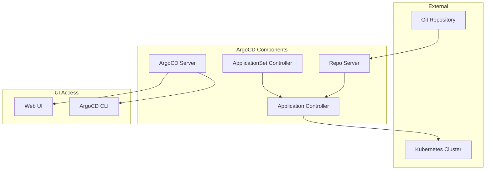

# 🚀 ArgoCD - GitOps e Deployment Contínuo

## 📋 Visão Geral

Este repositório contém **scripts automatizados** e **documentação completa** para instalação e configuração do ArgoCD em ambientes Kubernetes, oferecendo uma solução completa de GitOps para deployment contínuo.

### 🎯 Características

- ✅ **Instalação automatizada** com scripts bash
- ✅ **ApplicationSet** configurado para observabilidade
- ✅ **Helm charts** para instalação simplificada
- ✅ **Configuração de segurança** com certificados
- ✅ **Interface web** moderna e intuitiva

---

## 🏗️ Arquitetura do ArgoCD



---

## 🚀 Instalação

### 📋 Pré-requisitos

- **Cluster Kubernetes** (Kind recomendado)
- **Helm** (versão 3.8+)
- **kubectl** configurado
- **4GB RAM** mínimo
- **2GB espaço** em disco

### ⚡ Instalação Rápida

```bash
# 1. Navegar para o diretório
cd observabilidade-argocd

# 2. Executar instalação
chmod +x install.sh
./install.sh
```

### 🔧 Instalação Manual

```bash
# 1. Adicionar repositório Helm
helm repo add argo https://argoproj.github.io/argo-helm
helm repo update

# 2. Criar namespace
kubectl create namespace argocd

# 3. Instalar ArgoCD
helm install argocd argo/argo-cd \
  --namespace argocd \
  --set server.service.type=ClusterIP \
  --set server.ingress.enabled=false \
  --set configs.params."server\.insecure"=true
```

---

## 📊 Componentes Instalados

### 🔧 Core Components

| Componente | Namespace | Função | Porta |
|------------|-----------|--------|-------|
| **ArgoCD Server** | `argocd` | Interface web e API | 443 (HTTPS) |
| **Application Controller** | `argocd` | Controla aplicações | - |
| **Repo Server** | `argocd` | Servidor de repositórios Git | - |
| **ApplicationSet** | `argocd` | Gerencia múltiplas aplicações | - |

### 📦 ApplicationSet Configurado

O script instala automaticamente um ApplicationSet com:

- **SigNoz**: Plataforma de observabilidade
- **Prometheus**: Métricas do sistema
- **Node Exporter**: Métricas de nós

---

## 🌐 Acesso e Configuração

### 🔐 Credenciais de Acesso

```bash
# Obter senha do admin
kubectl -n argocd get secret argocd-initial-admin-secret -o jsonpath="{.data.password}" | base64 -d
```

### 🌐 Acesso à Interface Web

```bash
# Port-forward para ArgoCD
kubectl port-forward svc/argocd-server -n argocd 8080:443

# Acesse: https://localhost:8080
# Usuário: admin
# Senha: [senha obtida acima]
```

### 📱 Acesso via CLI

```bash
# Instalar ArgoCD CLI
curl -sSL -o argocd-linux-amd64 https://github.com/argoproj/argo-cd/releases/latest/download/argocd-linux-amd64
sudo install -m 555 argocd-linux-amd64 /usr/local/bin/argocd
rm argocd-linux-amd64

# Login via CLI
argocd login localhost:8080 --username admin --password [senha]
```

---

## 🔧 Configuração Avançada

### 📝 ApplicationSet Personalizado

```yaml
apiVersion: argoproj.io/v1alpha1
kind: ApplicationSet
metadata:
  name: custom-apps
  namespace: argocd
spec:
  generators:
  - list:
      elements:
      - name: minha-app
        namespace: production
        repoURL: https://github.com/meu-repo
        path: k8s/
        targetRevision: main
  template:
    metadata:
      name: '{{name}}'
      namespace: '{{namespace}}'
    spec:
      project: default
      source:
        repoURL: '{{repoURL}}'
        path: '{{path}}'
        targetRevision: '{{targetRevision}}'
      destination:
        server: https://kubernetes.default.svc
        namespace: '{{namespace}}'
      syncPolicy:
        automated:
          prune: true
          selfHeal: true
```

### 🔐 Configuração de Segurança

```bash
# Alterar senha do admin
argocd account update-password --account admin --current-password [senha-atual] --new-password [nova-senha]

# Configurar RBAC
kubectl apply -f - <<EOF
apiVersion: v1
kind: ConfigMap
metadata:
  name: argocd-rbac-cm
  namespace: argocd
data:
  policy.default: role:readonly
  policy.csv: |
    p, role:admin, applications, *, */*, allow
    p, role:admin, clusters, *, */*, allow
    p, role:admin, repositories, *, */*, allow
    g, argocd-admins, role:admin
EOF
```

---

## 📊 Monitoramento e Operação

### 🔍 Comandos de Verificação

```bash
# Status dos pods
kubectl get pods -n argocd

# Status dos ApplicationSets
kubectl get applicationset -n argocd

# Status das Applications
kubectl get applications -n argocd

# Logs do ArgoCD Server
kubectl logs -n argocd -l app.kubernetes.io/name=argocd-server

# Logs do Application Controller
kubectl logs -n argocd -l app.kubernetes.io/name=argocd-application-controller
```

### 📈 Métricas e Monitoramento

```bash
# Verificar métricas do ArgoCD
kubectl port-forward svc/argocd-server-metrics -n argocd 8083:8083

# Acesse: http://localhost:8083/metrics
```

---

## 🎯 Casos de Uso

### 👨‍💻 Para Desenvolvedores

- **Deployment automático** de aplicações
- **Rollback** fácil e rápido
- **Histórico** de deployments
- **Sincronização** com repositórios Git

### 🔧 Para DevOps

- **GitOps** workflow completo
- **Multi-cluster** management
- **ApplicationSet** para múltiplas aplicações
- **Integração** com CI/CD

### 📊 Para SRE

- **Observabilidade** de deployments
- **Alertas** de falhas
- **Métricas** de performance
- **Auditoria** de mudanças

---

## 🔧 Troubleshooting

### ❌ Problemas Comuns

#### Pods não ficam prontos
```bash
# Verificar logs
kubectl logs -n argocd -l app.kubernetes.io/name=argocd-server

# Verificar recursos
kubectl describe pod -n argocd -l app.kubernetes.io/name=argocd-server
```

#### ApplicationSet não cria Applications
```bash
# Verificar logs do ApplicationSet
kubectl logs -n argocd -l app.kubernetes.io/name=argocd-applicationset-controller

# Verificar configuração
kubectl get applicationset -n argocd -o yaml
```

#### Falha de autenticação
```bash
# Verificar secret
kubectl get secret argocd-initial-admin-secret -n argocd -o yaml

# Recriar secret se necessário
kubectl delete secret argocd-initial-admin-secret -n argocd
kubectl create secret generic argocd-initial-admin-secret -n argocd --from-literal=password=$(openssl rand -base64 16)
```

### 🔧 Comandos de Diagnóstico

```bash
# Verificar status do cluster
kubectl get nodes

# Verificar recursos disponíveis
kubectl top nodes
kubectl top pods -n argocd

# Verificar eventos
kubectl get events -n argocd --sort-by='.lastTimestamp'
```

---

## 📚 Documentação Adicional

### 🔗 Links Úteis

- **[ArgoCD Documentation](https://argo-cd.readthedocs.io/)** - Documentação oficial
- **[ApplicationSet](https://argocd-applicationset.readthedocs.io/)** - Gerenciamento de múltiplas aplicações
- **[GitOps Best Practices](https://www.gitops.tech/)** - Práticas recomendadas

### 📖 Exemplos Práticos

- **[Test API](test-api/k8s/argocd-app-*.yaml)** - Aplicações de exemplo
- **[Kustomize](test-api/k8s/base/)** - Configurações por ambiente
- **[Production](test-api/k8s/overlays/production/)** - Configurações de produção

---

## 🤝 Contribuição

### 📝 Como Contribuir

1. **Fork** o repositório
2. **Crie** uma branch para sua feature
3. **Atualize** a documentação
4. **Teste** as mudanças
5. **Abra** um Pull Request

### 📋 Padrões de Código

- **Bash**: Use `set -e` e tratamento de erros
- **YAML**: Indentação consistente
- **Documentação**: Markdown com exemplos práticos

---

## 📄 Licença

Este projeto está sob a licença **MIT**. Veja o arquivo [LICENSE](LICENSE) para detalhes.

---

**Versão**: 1.0.0  
**Última atualização**: $(date +%Y-%m-%d)  
**Status**: ✅ Documentação Completa
