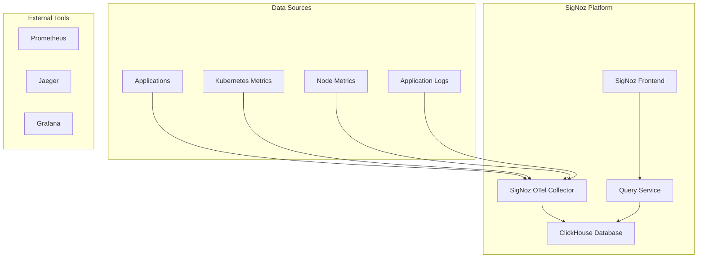

# 🔍 SigNoz - Plataforma de Observabilidade Completa

## 📋 Visão Geral

Este repositório contém **scripts automatizados** e **documentação completa** para instalação e configuração do SigNoz, oferecendo uma plataforma moderna de observabilidade com métricas, logs e traces em uma única interface.

### 🎯 Características

- ✅ **Instalação automatizada** via Helm
- ✅ **Interface moderna** e intuitiva
- ✅ **Observabilidade completa** (métricas, logs, traces)
- ✅ **Aplicação de exemplo** (HotROD) incluída
- ✅ **Métricas do Kubernetes** (kube-state-metrics, node-exporter)

---

## 🏗️ Arquitetura do SigNoz



---

## 🚀 Instalação

### 📋 Pré-requisitos

- **Cluster Kubernetes** (Kind recomendado)
- **Helm** (versão 3.8+)
- **kubectl** configurado
- **4GB RAM** mínimo
- **5GB espaço** em disco

### ⚡ Instalação Rápida

```bash
# 1. Navegar para o diretório
cd observabilidade-signoz

# 2. Executar instalação
chmod +x install.sh
./install.sh
```

### 🔧 Instalação Manual

```bash
# 1. Adicionar repositório Helm
helm repo add signoz https://charts.signoz.io
helm repo update

# 2. Criar namespace
kubectl create namespace platform

# 3. Instalar SigNoz
helm install signoz signoz/signoz -n platform

# 4. Instalar métricas do Kubernetes
kubectl apply -f https://github.com/kubernetes-sigs/metrics-server/releases/latest/download/components.yaml
```

---

## 📊 Componentes Instalados

### 🔧 Core Components

| Componente | Namespace | Função | Status |
|------------|-----------|--------|--------|
| **SigNoz Frontend** | `platform` | Interface web | ✅ Instalado |
| **Query Service** | `platform` | Processamento de queries | ✅ Instalado |
| **ClickHouse** | `platform` | Banco de dados | ✅ Instalado |
| **OTel Collector** | `platform` | Coleta de telemetria | ✅ Instalado |

### 📈 Métricas e Monitoramento

| Componente | Namespace | Função | Status |
|------------|-----------|--------|--------|
| **Metrics Server** | `kube-system` | Métricas do cluster | ✅ Instalado |
| **Kube State Metrics** | `monitoring` | Métricas do estado do K8s | ✅ Instalado |
| **Node Exporter** | `monitoring` | Métricas dos nós | ✅ Instalado |

### 🧪 Aplicação de Exemplo

| Componente | Namespace | Função | Status |
|------------|-----------|--------|--------|
| **HotROD** | `hotrod` | Aplicação de exemplo | ✅ Instalado |

---

## 🌐 Acesso e Configuração

### 🔧 Comandos de Port-Forward

```bash
# SigNoz UI
kubectl port-forward -n platform svc/signoz 3301:8080

# HotROD App
kubectl port-forward svc/hotrod -n hotrod 8080:8080
```

### 🌐 URLs de Acesso

| Serviço | URL | Descrição |
|---------|-----|-----------|
| **SigNoz UI** | http://localhost:3301 | Interface principal |
| **HotROD App** | http://localhost:8080 | Aplicação de exemplo |

---

## 📊 Funcionalidades do SigNoz

### 🔍 Métricas

- **Métricas do Kubernetes**: CPU, memória, pods, nodes
- **Métricas de aplicações**: Latência, throughput, erros
- **Métricas customizadas**: Métricas específicas da aplicação

### 📝 Logs

- **Logs centralizados**: Todos os logs em um local
- **Busca avançada**: Filtros por timestamp, nível, serviço
- **Correlação**: Logs relacionados a traces específicos

### 🔗 Traces

- **Distributed tracing**: Rastreamento de requisições
- **Service map**: Mapa de dependências entre serviços
- **Performance analysis**: Análise de latência e bottlenecks

---

## 🎯 Casos de Uso

### 👨‍💻 Para Desenvolvedores

- **Debugging** com traces distribuídos
- **Análise de performance** de aplicações
- **Correlação** entre logs e traces
- **Monitoramento** de APIs

### 🔧 Para DevOps

- **Observabilidade completa** do sistema
- **Alertas** baseados em métricas
- **Dashboards** personalizados
- **Integração** com CI/CD

### 📊 Para SRE

- **SLI/SLO** monitoring
- **Incident response** com dados contextuais
- **Capacity planning** com métricas históricas
- **Root cause analysis** com traces

---

## 🔧 Configuração Avançada

### 📊 Dashboards Personalizados

```yaml
# Exemplo de dashboard personalizado
apiVersion: v1
kind: ConfigMap
metadata:
  name: custom-dashboard
  namespace: platform
data:
  dashboard.json: |
    {
      "title": "Custom Dashboard",
      "panels": [
        {
          "title": "Request Rate",
          "type": "graph",
          "targets": [
            {
              "expr": "rate(http_requests_total[5m])",
              "legendFormat": "{{service}}"
            }
          ]
        }
      ]
    }
```

### 🚨 Alertas Personalizados

```yaml
# Exemplo de alerta personalizado
apiVersion: v1
kind: ConfigMap
metadata:
  name: custom-alerts
  namespace: platform
data:
  alerts.yaml: |
    groups:
    - name: application
      rules:
      - alert: HighErrorRate
        expr: rate(http_requests_total{status=~"5.."}[5m]) > 0.1
        for: 5m
        labels:
          severity: warning
        annotations:
          summary: "High error rate detected"
```

---

## 🔧 Troubleshooting

### ❌ Problemas Comuns

#### SigNoz não inicia
```bash
# Verificar logs
kubectl logs -n platform -l app.kubernetes.io/name=signoz

# Verificar recursos
kubectl describe pod -n platform -l app.kubernetes.io/name=signoz
```

#### ClickHouse não conecta
```bash
# Verificar logs do ClickHouse
kubectl logs -n platform -l app.kubernetes.io/name=clickhouse

# Verificar conectividade
kubectl exec -n platform -l app.kubernetes.io/name=signoz -- nslookup clickhouse.platform.svc.cluster.local
```

#### HotROD não gera traces
```bash
# Verificar logs do HotROD
kubectl logs -n hotrod -l app=hotrod

# Verificar configuração de telemetria
kubectl describe pod -n hotrod -l app=hotrod
```

### 🔧 Comandos de Diagnóstico

```bash
# Verificar status dos pods
kubectl get pods -n platform
kubectl get pods -n hotrod

# Verificar serviços
kubectl get svc -n platform
kubectl get svc -n hotrod

# Verificar logs
kubectl logs -n platform -l app.kubernetes.io/name=signoz
kubectl logs -n hotrod -l app=hotrod
```

---

## 📚 Configuração Avançada

### 🔧 Personalização do SigNoz

```yaml
# Exemplo de configuração personalizada
apiVersion: v1
kind: ConfigMap
metadata:
  name: signoz-config
  namespace: platform
data:
  config.yaml: |
    frontend:
      service:
        type: ClusterIP
        port: 8080
    otelCollector:
      service:
        type: ClusterIP
        port: 4317
    clickhouse:
      persistence:
        enabled: true
        size: 10Gi
```

### 📊 Configuração de Métricas

```yaml
# Configuração para coleta de métricas específicas
apiVersion: v1
kind: ConfigMap
metadata:
  name: metrics-config
  namespace: platform
data:
  prometheus.yml: |
    global:
      scrape_interval: 15s
    scrape_configs:
      - job_name: 'kubernetes-pods'
        kubernetes_sd_configs:
          - role: pod
        relabel_configs:
          - source_labels: [__meta_kubernetes_pod_annotation_prometheus_io_scrape]
            action: keep
            regex: true
```

---

## 📚 Documentação Adicional

### 🔗 Links Úteis

- **[SigNoz Documentation](https://signoz.io/docs/)** - Documentação oficial
- **[SigNoz GitHub](https://github.com/SigNoz/signoz)** - Código fonte
- **[OpenTelemetry](https://opentelemetry.io/)** - Padrão de telemetria

### 📖 Exemplos Práticos

- **[HotROD App](hotrod/)** - Aplicação de exemplo
- **[Test API](test-api/k8s/)** - API com telemetria
- **[Collector Configs](collector-daemonset.yaml)** - Configurações dos collectors

---

## 🎯 Próximos Passos

Após a instalação do SigNoz, você pode:

1. **Explorar** a interface e funcionalidades
2. **Configurar** dashboards personalizados
3. **Criar** alertas para monitoramento
4. **Integrar** com aplicações existentes

---

## 🤝 Contribuição

### 📝 Como Contribuir

1. **Fork** o repositório
2. **Crie** uma branch para sua feature
3. **Atualize** a documentação
4. **Teste** as mudanças
5. **Abra** um Pull Request

### 📋 Padrões de Código

- **Bash**: Use `set -e` e tratamento de erros
- **YAML**: Indentação consistente
- **Documentação**: Markdown com exemplos práticos

---

## 📄 Licença

Este projeto está sob a licença **MIT**. Veja o arquivo [LICENSE](LICENSE) para detalhes.

---

**Versão**: 1.0.0  
**Última atualização**: $(date +%Y-%m-%d)  
**Status**: ✅ Documentação Completa
