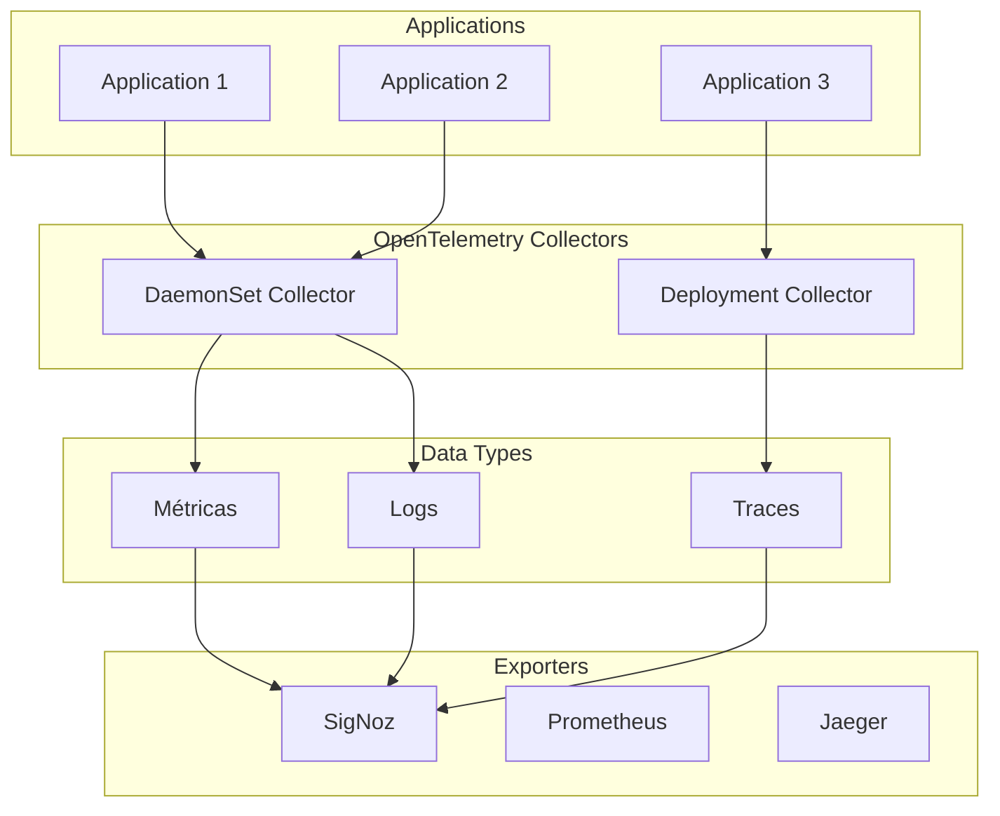

# 📡 OpenTelemetry - Coleta Universal de Telemetria

## 📋 Visão Geral

Este repositório contém **scripts automatizados** e **documentação completa** para instalação e configuração do OpenTelemetry Operator e Collectors, oferecendo uma solução completa de coleta de telemetria (métricas, logs e traces) em ambientes Kubernetes.

### 🎯 Características

- ✅ **Instalação automatizada** do OpenTelemetry Operator
- ✅ **Cert-Manager** para gerenciamento de certificados
- ✅ **Collectors otimizados** (DaemonSet + Deployment)
- ✅ **Configuração de pipelines** para métricas, logs e traces
- ✅ **Integração** com SigNoz e outras ferramentas

---

## 🏗️ Arquitetura do OpenTelemetry



---

## 🚀 Instalação

### 📋 Pré-requisitos

- **Cluster Kubernetes** (Kind recomendado)
- **Helm** (versão 3.8+)
- **kubectl** configurado
- **4GB RAM** mínimo
- **2GB espaço** em disco

### ⚡ Instalação Rápida

```bash
# 1. Navegar para o diretório
cd observabilidade-opentelemetry

# 2. Executar instalação
chmod +x install.sh
./install.sh
```

### 🔧 Instalação Manual

```bash
# 1. Instalar cert-manager
helm repo add jetstack https://charts.jetstack.io
helm install cert-manager jetstack/cert-manager \
  --namespace cert-manager \
  --create-namespace \
  --version v1.13.0 \
  --set installCRDs=true

# 2. Instalar OpenTelemetry Operator
helm repo add open-telemetry https://open-telemetry.github.io/opentelemetry-helm-charts
helm install opentelemetry-operator open-telemetry/opentelemetry-operator \
  --namespace opentelemetry-operator-system \
  --create-namespace
```

---

## 📊 Componentes Instalados

### 🔧 Core Components

| Componente | Namespace | Função | Status |
|------------|-----------|--------|--------|
| **Cert-Manager** | `cert-manager` | Gerenciamento de certificados | ✅ Instalado |
| **OpenTelemetry Operator** | `opentelemetry-operator-system` | Operador para collectors | ✅ Instalado |
| **DaemonSet Collector** | `platform` | Coleta de logs e métricas | ✅ Configurado |
| **Deployment Collector** | `platform` | Coleta de traces | ✅ Configurado |

### 📡 Collector Configurations

#### DaemonSet Collector (Logs + Métricas)
```yaml
apiVersion: opentelemetry.io/v1beta1
kind: OpenTelemetryCollector
metadata:
  name: otel-collector-daemonset
  namespace: platform
spec:
  mode: daemonset
  config: |
    receivers:
      otlp:
        protocols:
          grpc:
            endpoint: 0.0.0.0:4317
          http:
            endpoint: 0.0.0.0:4318
      prometheus:
        config:
          scrape_configs:
            - job_name: 'kubernetes-pods'
              kubernetes_sd_configs:
                - role: pod
      filelog:
        include: [ /var/log/pods/*/*/*.log ]
        exclude: [ /var/log/pods/*/*/*.log.gz ]
        start_at: beginning
    
    processors:
      batch:
        send_batch_size: 10000
        timeout: 10s
      memory_limiter:
        check_interval: 1s
        limit_mib: 200
    
    exporters:
      otlp:
        endpoint: signoz-otel-collector.platform.svc.cluster.local:4317
        tls:
          insecure: true
    
    service:
      pipelines:
        metrics:
          receivers: [otlp, prometheus]
          processors: [memory_limiter, batch]
          exporters: [otlp]
        logs:
          receivers: [otlp, filelog]
          processors: [memory_limiter, batch]
          exporters: [otlp]
```

#### Deployment Collector (Traces)
```yaml
apiVersion: opentelemetry.io/v1beta1
kind: OpenTelemetryCollector
metadata:
  name: otel-collector-deployment
  namespace: platform
spec:
  mode: deployment
  config: |
    receivers:
      otlp:
        protocols:
          grpc:
            endpoint: 0.0.0.0:4317
          http:
            endpoint: 0.0.0.0:4318
    
    processors:
      batch:
        send_batch_size: 10000
        timeout: 10s
      memory_limiter:
        check_interval: 1s
        limit_mib: 200
    
    exporters:
      otlp:
        endpoint: signoz-otel-collector.platform.svc.cluster.local:4317
        tls:
          insecure: true
    
    service:
      pipelines:
        traces:
          receivers: [otlp]
          processors: [memory_limiter, batch]
          exporters: [otlp]
```

---

## 🔧 Configuração e Gerenciamento

### 📊 Comandos de Verificação

```bash
# Status dos pods
kubectl get pods --all-namespaces

# Status dos OpenTelemetry Collectors
kubectl get opentelemetrycollector -n platform

# Status dos serviços
kubectl get svc --all-namespaces

# Logs dos collectors
kubectl logs -n platform -l app.kubernetes.io/name=opentelemetry-collector
```

### 🔍 Diagnóstico

```bash
# Verificar logs do cert-manager
kubectl logs -n cert-manager -l app.kubernetes.io/name=cert-manager

# Verificar logs do operator
kubectl logs -n opentelemetry-operator-system -l app.kubernetes.io/name=opentelemetry-operator

# Verificar eventos
kubectl get events --all-namespaces --sort-by='.lastTimestamp'
```

---

## 🎯 Casos de Uso

### 👨‍💻 Para Desenvolvedores

- **Instrumentação** de aplicações com OpenTelemetry
- **Coleta automática** de métricas, logs e traces
- **Debugging** com traces distribuídos
- **Monitoramento** de performance

### 🔧 Para DevOps

- **Coleta centralizada** de telemetria
- **Processamento** e enriquecimento de dados
- **Exportação** para múltiplos backends
- **Configuração** via Kubernetes

### 📊 Para SRE

- **Observabilidade completa** do sistema
- **Correlação** entre métricas, logs e traces
- **Alertas** baseados em telemetria
- **Análise** de performance e disponibilidade

---

## 🔧 Troubleshooting

### ❌ Problemas Comuns

#### Cert-Manager não inicia
```bash
# Verificar logs
kubectl logs -n cert-manager -l app.kubernetes.io/name=cert-manager

# Verificar recursos
kubectl describe pod -n cert-manager -l app.kubernetes.io/name=cert-manager
```

#### OpenTelemetry Operator não inicia
```bash
# Verificar logs
kubectl logs -n opentelemetry-operator-system -l app.kubernetes.io/name=opentelemetry-operator

# Verificar CRDs
kubectl get crd | grep opentelemetry
```

#### Collectors não coletam dados
```bash
# Verificar configuração
kubectl get opentelemetrycollector -n platform -o yaml

# Verificar logs
kubectl logs -n platform -l app.kubernetes.io/name=opentelemetry-collector

# Verificar conectividade
kubectl exec -n platform -l app.kubernetes.io/name=opentelemetry-collector -- nslookup signoz-otel-collector.platform.svc.cluster.local
```

### 🔧 Comandos de Diagnóstico

```bash
# Verificar recursos do cluster
kubectl top nodes
kubectl top pods -n platform

# Verificar configuração dos collectors
kubectl describe opentelemetrycollector -n platform

# Verificar endpoints
kubectl get endpoints -n platform
```

---

## 📚 Configuração Avançada

### 🔧 Personalização dos Collectors

```yaml
# Exemplo de configuração personalizada
apiVersion: opentelemetry.io/v1beta1
kind: OpenTelemetryCollector
metadata:
  name: custom-collector
  namespace: platform
spec:
  mode: deployment
  config: |
    receivers:
      otlp:
        protocols:
          grpc:
            endpoint: 0.0.0.0:4317
          http:
            endpoint: 0.0.0.0:4318
    
    processors:
      batch:
        send_batch_size: 1000
        timeout: 5s
      memory_limiter:
        check_interval: 1s
        limit_mib: 100
    
    exporters:
      otlp:
        endpoint: signoz-otel-collector.platform.svc.cluster.local:4317
        tls:
          insecure: true
      logging:
        verbosity: detailed
    
    service:
      pipelines:
        traces:
          receivers: [otlp]
          processors: [memory_limiter, batch]
          exporters: [otlp, logging]
```

### 📊 Configuração de Métricas

```yaml
# Configuração para coleta de métricas específicas
receivers:
  prometheus:
    config:
      scrape_configs:
        - job_name: 'kubernetes-pods'
          kubernetes_sd_configs:
            - role: pod
          relabel_configs:
            - source_labels: [__meta_kubernetes_pod_annotation_prometheus_io_scrape]
              action: keep
              regex: true
            - source_labels: [__meta_kubernetes_pod_annotation_prometheus_io_path]
              action: replace
              target_label: __metrics_path__
              regex: (.+)
```

---

## 📚 Documentação Adicional

### 🔗 Links Úteis

- **[OpenTelemetry Documentation](https://opentelemetry.io/docs/)** - Documentação oficial
- **[OpenTelemetry Collector](https://opentelemetry.io/docs/collector/)** - Documentação do Collector
- **[OpenTelemetry Operator](https://github.com/open-telemetry/opentelemetry-operator)** - Operador Kubernetes

### 📖 Exemplos Práticos

- **[Test API](test-api/k8s/api-with-telemetry.yaml)** - Aplicação com telemetria
- **[Collector Configs](collector-daemonset.yaml)** - Configurações dos collectors
- **[RBAC](rbac-daemonset.yaml)** - Configurações de segurança

---

## 🎯 Próximos Passos

Após a instalação do OpenTelemetry, você pode:

1. **Instalar SigNoz** para visualizar os dados coletados
2. **Configurar aplicações** para enviar telemetria
3. **Criar dashboards** e alertas
4. **Integrar** com outras ferramentas de observabilidade

---

## 🤝 Contribuição

### 📝 Como Contribuir

1. **Fork** o repositório
2. **Crie** uma branch para sua feature
3. **Atualize** a documentação
4. **Teste** as mudanças
5. **Abra** um Pull Request

### 📋 Padrões de Código

- **Bash**: Use `set -e` e tratamento de erros
- **YAML**: Indentação consistente
- **Documentação**: Markdown com exemplos práticos

---

## 📄 Licença

Este projeto está sob a licença **MIT**. Veja o arquivo [LICENSE](LICENSE) para detalhes.

---

**Versão**: 1.0.0  
**Última atualização**: $(date +%Y-%m-%d)  
**Status**: ✅ Documentação Completa
